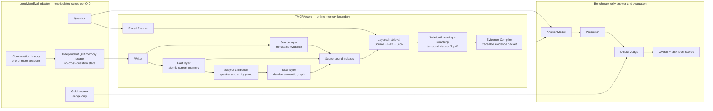

# TMCRA — Agent Memory Engine

<p align="center">
  
</p>

<p align="center">
  <a href="README.zh-CN.md">简体中文</a>
</p>

TMCRA is a memory engine for long-running agents. It turns multi-turn and multi-session conversations into scope-isolated, source-traceable memory, then returns compact evidence for the agent's next response.

This repository contains the current TMCRA algorithm snapshot, learned graph-scoring artifacts, training records, benchmark results, and a reproducible LongMemEval pipeline. Hosted APIs, account systems, billing, and production control-plane services are outside this repository.

## Latest benchmark result

TMCRA achieved **411 / 500 = 82.2%** on LongMemEval S500.

| Task category | Correct / Total | Accuracy |
| --- | ---: | ---: |
| Knowledge Update | 71 / 78 | 91.0% |
| Multi-session | 90 / 133 | 67.7% |
| Single-session Assistant | 55 / 56 | 98.2% |
| Single-session Preference | 27 / 30 | 90.0% |
| Single-session User | 67 / 70 | 95.7% |
| Temporal Reasoning | 101 / 133 | 75.9% |
| **Overall** | **411 / 500** | **82.2%** |

The machine-readable scorecard is [`results/latest_benchmark.json`](results/latest_benchmark.json). The complete reproduction entrypoint is [`benchmarks/longmemeval/`](benchmarks/longmemeval/README.md).

## Architecture

TMCRA separates memory construction from answer generation.

At write time, the Writer preserves the original conversation in the **Source** layer and derives atomic, current-state memory in the **Fast** layer. Subject attribution keeps user statements, assistant actions, quotations, and third-party facts attached to the correct speaker or entity. Eligible information is then organized into the **Slow** semantic graph for durable cross-session relations. Every derived record remains traceable to Source.

At recall time, the Recall Planner interprets the new question, searches Source, Fast, and Slow, and sends candidates through learned node/path scoring, reranking, temporal handling, deduplication, and bounded Top-K packing. The Evidence Compiler emits a structured, source-bound evidence packet for the downstream agent.



### System boundary and benchmark isolation

- **TMCRA core ends at the evidence packet.** The Answer Model and Judge are benchmark harness components, not part of the online memory engine.
- **Gold answers are visible only to the Judge.** Writer, memory layers, Planner, retrieval, reranking, Evidence Compiler, and Answer Model cannot read them.
- **Every LongMemEval QID receives an independent memory scope.** Sessions belonging to the same question can share memory; different questions cannot contaminate one another.
- **Speaker identity is retained.** User-provided facts and assistant-produced progress are both recallable without merging their authorship.

## Reproduce LongMemEval

The maintained benchmark package lives in [`benchmarks/longmemeval/`](benchmarks/longmemeval/README.md). Its documentation covers asset checksums, provider configuration, stage validation, output paths, and result aggregation.

```bash
cd benchmarks/longmemeval

python3.12 -m venv .venv
source .venv/bin/activate
python -m pip install --upgrade pip
python -m pip install -r requirements.txt
python -m pip install -e .

python scripts/fetch_assets.py --manifest configs/assets.lock.json --kind all
```

Copy the example environment files and configure the Writer, Answer, and Judge endpoints as described in the benchmark README. Then choose one of the two paths:

```bash
# Offline fixture and pipeline checks; no external model calls
bash scripts/reproduce_smoke.sh

# Complete LongMemEval S500 pipeline
bash scripts/reproduce_s500.sh
```

The full run builds scoped memory, performs layered recall, compiles evidence, generates answers with the fixed benchmark answer layer, evaluates predictions with the Judge, and exports the overall and six task-level scores. External model calls can produce small run-to-run variation; the released scorecard is the reference result for this version.

## Repository layout

```text
benchmarks/longmemeval/   maintained LongMemEval reproduction pipeline
code/                     earlier runtime and adapter snapshots
models/                   released graph-scoring artifacts and training outputs
results/                  latest scorecard plus retained historical outputs
docs/                     training, baseline, and extension notes
assets/                   TMCRA visual assets
```

## Historical baseline

The existing `results/predictions.jsonl`, `results/judge_gpt4o_alias_vectorengine.jsonl`, its summary, and the archived run describe the frozen **310 / 500 = 62.0%** baseline from 2026-05-25. They remain in the repository for longitudinal comparison and are **not** the latest 82.2% result. See [`results/README.md`](results/README.md) for the distinction.

## Developers

- **Yu Haoxin** ([@reshuibuduo](https://github.com/reshuibuduo)) — creator, lead developer, and TMCRA algorithm engineering.
- **OpenAI Codex** — development and reproducibility engineering assistant.

See [`AUTHORS.md`](AUTHORS.md) for attribution details.

## Citation

See [`CITATION.cff`](CITATION.cff). Research using the LongMemEval benchmark should also cite the LongMemEval authors and paper.

## License

TMCRA is released under the [Apache License 2.0](LICENSE). Third-party datasets, models, and components retain their own licenses.
