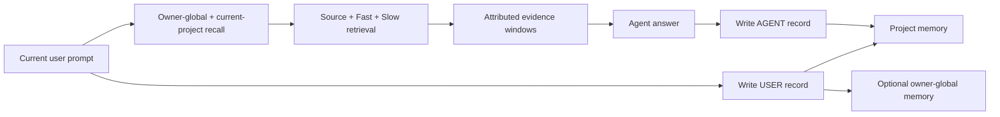

# TMCRA — Local Agent Memory OS

<p align="center">
  
</p>

<p align="center"><a href="README.zh-CN.md">简体中文</a></p>

TMCRA gives long-running agents persistent, source-traceable memory across sessions and applications. A user prompt triggers recall from the owner-global and current-project scopes; after the answer, the user message and agent response are written as separate, attributed records.

This repository includes an owner-local runtime. Clone it, choose an OpenAI-compatible API endpoint or a local generation model, and run the complete memory service on `127.0.0.1`. No TMCRA account or production server is required.

## Local quick start

Requirements: Python 3.12, Git with Git LFS, and at least 8 GiB system RAM. The default BYOK installation downloads the released graph scorers, one local embedding model, PyTorch, and runtime dependencies.

### Windows PowerShell

```powershell
git clone https://github.com/reshuibuduo/TMCRA-Agent-Memory.git
cd TMCRA-Agent-Memory
git lfs install
powershell -ExecutionPolicy Bypass -File .\scripts\install-local.ps1
powershell -ExecutionPolicy Bypass -File .\scripts\start-local.ps1
```

The installer asks for a credential-free OpenAI-compatible `/v1` URL, a model ID, and the user's API key. The key is written only to `.tmcra/config/runtime/secrets/byok-api.key`; it is never serialized into the runtime JSON.

### Linux or macOS

```bash
git clone https://github.com/reshuibuduo/TMCRA-Agent-Memory.git
cd TMCRA-Agent-Memory
git lfs install
bash scripts/install-local.sh
bash scripts/start-local.sh
```

For non-interactive installation, set `TMCRA_BYOK_BASE_URL`, `TMCRA_BYOK_MODEL`, and `TMCRA_BYOK_API_KEY` for the installer process. See [Local deployment](docs/LOCAL_DEPLOYMENT.md) for GPU selection, model profiles, local-generation mode, health checks, and uninstall behavior.

After starting the API, run `.tmcra/venv/bin/python scripts/smoke_local_api.py`
(or `.\.tmcra\venv\Scripts\python.exe .\scripts\smoke_local_api.py` on
Windows) to verify write, recall, provenance, graph, model-generated and
evidence-cited Personal Knowledge, usage, and deletion through one disposable
project. It fails if knowledge generation falls back without using the
configured model. Add `--allow-knowledge-fallback` only when you deliberately
disabled that optional task.

### Connect Codex

With the local API running:

```powershell
powershell -ExecutionPolicy Bypass -File .\scripts\install-codex-local.ps1
```

Restart Codex, open `/hooks`, review the four local lifecycle commands, and grant trust. A new prompt then recalls relevant local memory automatically; the prompt and completed answer are stored as separate role-attributed records.

The source release also contains a tested DeepSeek Harness technical preview plus shared Claude Code and ZCode hook manifests. See [Local tool integrations](docs/LOCAL_INTEGRATIONS.md) for the support matrix and exact acceptance evidence.

## What runs locally

- Source/Fast/Slow memory construction with immutable source evidence.
- Separate user and agent authorship; one project scope plus an optional owner-global scope.
- Cross-session and cross-application recall without merging unrelated projects.
- Learned graph-node and path scoring with a local embedding index.
- Evidence-window packing for injection into the next agent prompt.
- Visual Atlas and Personal Knowledge projections.
- Local token-usage ledger for the user's selected model provider.
- Inspectable source messages plus message-level and project-level deletion.
- Loopback-only FastAPI service with a generated local bearer token.

The hosted account, subscription, billing, staff, tenant, production deployment, and operational control planes are intentionally excluded. The exact boundary is documented in [Public release boundary](docs/PUBLIC_RELEASE_BOUNDARY.md) and enforced by `scripts/audit_public_release.py`.

## Runtime flow



A session is provenance within a project, not an independent recall scope. This keeps conversations in one project connected while preventing ten unrelated projects from collapsing into one graph.

## Local API

The service listens on `http://127.0.0.1:2009`. Read the local token from `.tmcra/config/runtime/secrets/local-api.token` and send it as a bearer token.

Core endpoints:

| Method | Path | Purpose |
| --- | --- | --- |
| `GET` | `/v1/health` | Secret-free health status |
| `POST` | `/v1/recall` | Recall evidence for the current user prompt |
| `POST` | `/v1/messages` | Persist one attributed source message |
| `GET` | `/v1/messages` | Inspect stored source messages |
| `DELETE` | `/v1/messages/{message_id}` | Delete one message and grounded derivatives |
| `DELETE` | `/v1/projects/{project_id}` | Delete a project, its global derivatives, knowledge, and usage metadata |
| `GET` | `/v1/projects/{project_id}/graph` | Build the Visual Atlas payload |
| `POST` | `/v1/projects/{project_id}/knowledge/build` | Build Personal Knowledge |
| `GET` | `/v1/usage` | Read local provider-token usage |

The complete request/response contract and turn ordering are in [Local API](docs/LOCAL_API.md).

## Generation choices

`BYOK` is the default: the user supplies an OpenAI-compatible endpoint, model ID, and API key. The selected model performs structured memory writing and reconciliation, plus Personal Knowledge generation when that projection is enabled. Recall itself stays local and uses the embedding index plus the released graph-node and path scorers; it does not make a provider-model call.

`local-model` is available for users who want generation to remain on the machine. The recommended full-quality profile is a Qwen3.6 35B-A3B GGUF configured for 32K context through `llama-server`; its download is approximately 12.74 GiB. The suggested hardware target is an RTX 5090D 32 GB or better. TMCRA also exposes model-policy inspection commands so users can make an explicit resource decision before downloading.

## Security and privacy

- The API refuses non-loopback binding.
- Provider keys live in permission-restricted local secret files and are omitted from config, health, usage, and error responses.
- Released scorer weights are loaded with `weights_only=True` and verified against byte counts and SHA-256 values in the public manifest.
- BYOK sends memory-processing prompts to the endpoint selected by the user. Local-model mode keeps those generation calls on loopback.
- Explicit deletion rewrites free SQLite pages and truncates WAL files. It cannot erase copies already held by filesystem backups, snapshots, or an external model provider.

Run the release audit before publishing:

```bash
python scripts/audit_public_release.py --history
```

## LongMemEval result

TMCRA achieved **411 / 500 = 82.2%** on the released LongMemEval S500 scorecard.

| Task | Correct / total | Accuracy |
| --- | ---: | ---: |
| Knowledge Update | 71 / 78 | 91.0% |
| Multi-session | 90 / 133 | 67.7% |
| Single-session Assistant | 55 / 56 | 98.2% |
| Single-session Preference | 27 / 30 | 90.0% |
| Single-session User | 67 / 70 | 95.7% |
| Temporal Reasoning | 101 / 133 | 75.9% |
| **Overall** | **411 / 500** | **82.2%** |

The machine-readable scorecard is [`results/latest_benchmark.json`](results/latest_benchmark.json). Reproduction instructions are in [`benchmarks/longmemeval/`](benchmarks/longmemeval/README.md). The retained 310/500 artifact is a historical baseline and is labelled separately in [`results/README.md`](results/README.md).

## Repository layout

```text
runtime/                  owner-local memory engine and loopback API
scripts/                  install, start, uninstall, and release-audit tools
integrations/             owner-local Codex, DSH, Claude Code, and ZCode adapters
benchmarks/longmemeval/   maintained LongMemEval reproduction pipeline
models/                   released inference weights and integrity manifests
results/                  current scorecard and labelled historical artifacts
docs/                     deployment, API, security boundary, and training notes
code/                     earlier public runtime and adapter snapshots
```

## Developers

- **Yu Haoxin** ([@reshuibuduo](https://github.com/reshuibuduo)) — creator, lead developer, and TMCRA algorithm engineering.
- **OpenAI Codex** — development and reproducibility engineering assistant.

See [`AUTHORS.md`](AUTHORS.md) and [`CITATION.cff`](CITATION.cff).

## License

TMCRA is released under the [Apache License 2.0](LICENSE). Third-party datasets, models, and components retain their own licenses; see the relevant notices and model cards.
