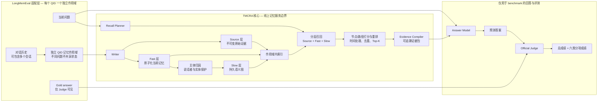

# TMCRA — 面向 Agent 的记忆引擎

<p align="center">
  
</p>

<p align="center">
  <a href="README.md">English</a>
</p>

TMCRA 是面向长期运行 Agent 的记忆引擎。它把多轮、跨会话的对话整理成作用域隔离且可追溯到原文的记忆，并在下一轮提问到来后，为 Agent 返回紧凑、相关的证据。

本仓库包含当前版本的 TMCRA 算法快照、图打分模型产物、训练记录、benchmark 成绩，以及可复现的 LongMemEval 链路。线上 API、账号、计费和生产控制面不在本仓库的开源范围内。

## 最新 benchmark 成绩

TMCRA 在 LongMemEval S500 上取得 **411 / 500 = 82.2%**。

| 任务类型 | 正确数 / 总数 | 准确率 |
| --- | ---: | ---: |
| 信息更新（Knowledge Update） | 71 / 78 | 91.0% |
| 跨会话整合（Multi-session） | 90 / 133 | 67.7% |
| 单会话助手信息（Single-session Assistant） | 55 / 56 | 98.2% |
| 单会话偏好（Single-session Preference） | 27 / 30 | 90.0% |
| 单会话用户信息（Single-session User） | 67 / 70 | 95.7% |
| 时间推理（Temporal Reasoning） | 101 / 133 | 75.9% |
| **总成绩** | **411 / 500** | **82.2%** |

机器可读的成绩文件位于 [`results/latest_benchmark.json`](results/latest_benchmark.json)。完整复现入口位于 [`benchmarks/longmemeval/`](benchmarks/longmemeval/README.zh-CN.md)。

## 架构

TMCRA 把记忆构建和最终回答生成明确分开。

写入时，Writer 将原始对话保存在 **Source** 层，并把其中可复用、反映当前状态的信息整理成 **Fast** 层的原子记忆。主体归因模块会保留用户陈述、Agent 执行进度、引用内容和第三方事实各自的说话者或实体，避免把不同主体混在一起。符合条件的信息随后进入 **Slow** 语义图，用于建立稳定的跨会话关系；所有派生记忆都能追溯回 Source 原文。

召回时，Recall Planner 先理解新的问题，再从 Source、Fast 和 Slow 三层检索候选证据。候选会经过学习式节点/路径打分、重排、时间处理、去重和有界 Top-K 打包，最后由 Evidence Compiler 生成带来源绑定的结构化证据包，交给下游 Agent 使用。



### 系统边界与 benchmark 隔离

- **TMCRA 核心止于证据包。** Answer Model 和 Judge 属于 benchmark harness，不属于线上记忆引擎本身。
- **Gold answer 只对 Judge 开放。** Writer、各记忆层、Planner、召回、重排、Evidence Compiler 和 Answer Model 都不能读取它。
- **LongMemEval 的每个 QID 都使用独立记忆作用域。** 同一道题内部的多个会话可以共享记忆，不同题目之间不能串数据。
- **对话主体不会被混合。** 用户提供的信息和 Agent 完成的工作进度都会被记录和召回，同时保留各自的作者身份。

## 复现 LongMemEval

维护中的 benchmark 包位于 [`benchmarks/longmemeval/`](benchmarks/longmemeval/README.zh-CN.md)。其中的文档说明了资源校验、模型服务配置、各阶段产物检查、输出位置和成绩汇总方法。

```bash
cd benchmarks/longmemeval

python3.12 -m venv .venv
source .venv/bin/activate
python -m pip install --upgrade pip
python -m pip install -r requirements.txt
python -m pip install -e .

python scripts/fetch_assets.py --manifest configs/assets.lock.json --kind all
```

按照 benchmark README 复制配置示例，并填写 Writer、Answer 和 Judge 服务地址。随后可以选择两种运行方式：

```bash
# 离线 fixture 与链路检查，不调用外部模型
bash scripts/reproduce_smoke.sh

# 完整 LongMemEval S500 链路
bash scripts/reproduce_s500.sh
```

完整链路会依次构建隔离记忆、执行分层召回、整理证据、使用固定的 benchmark 回答层生成答案、交给 Judge 评测，并导出总成绩和六类分项成绩。外部模型调用可能带来少量运行波动；本版本发布的 scorecard 是对应的参考成绩。

## 仓库结构

```text
benchmarks/longmemeval/   持续维护的 LongMemEval 复现链路
code/                     较早版本的运行时与适配器快照
models/                   图打分模型产物与训练输出
results/                  最新成绩文件与保留的历史产物
docs/                     训练、历史基线与扩展说明
assets/                   TMCRA 视觉资源
```

## 历史基线

仓库中原有的 `results/predictions.jsonl`、`results/judge_gpt4o_alias_vectorengine.jsonl`、对应 summary 和压缩归档，属于 2026-05-25 冻结的 **310 / 500 = 62.0%** 历史基线。它们会继续保留用于纵向对比，但**不代表当前 82.2% 成绩**。具体区分见 [`results/README.md`](results/README.md)。

## 开发者

- **Yu Haoxin**（[@reshuibuduo](https://github.com/reshuibuduo)）— 项目创建者、主要开发者与 TMCRA 算法工程。
- **OpenAI Codex** — 开发与可复现性工程助手。

详细署名见 [`AUTHORS.md`](AUTHORS.md)。

## 引用

引用信息见 [`CITATION.cff`](CITATION.cff)。使用 LongMemEval benchmark 的研究还应引用 LongMemEval 的作者和论文。

## 许可证

TMCRA 采用 [Apache License 2.0](LICENSE) 开源。第三方数据集、模型与组件继续遵循各自的许可证。
