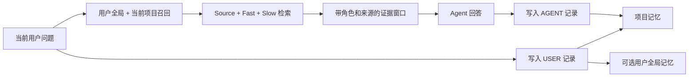

# TMCRA — 本地 Agent Memory OS

<p align="center">
  
</p>

<p align="center"><a href="README.md">English</a></p>

TMCRA 为长期运行的 Agent 提供跨会话、跨软件且可追溯来源的持久记忆。当前用户提出问题后，系统从用户全局作用域和当前项目作用域召回证据；Agent 完成回答后，用户消息与 Agent 回答会按各自身份分别写入。

本仓库包含可独立运行的本地版。用户克隆仓库后，可填写自己的 OpenAI 兼容 API Key，也可以选择本地生成模型；完整记忆服务只监听 `127.0.0.1`，不要求注册 TMCRA 账号，也不依赖 TMCRA 生产服务器。

## 本地快速安装

要求：Python 3.12、带 Git LFS 的 Git，以及至少 8 GiB 系统内存。默认 BYOK 安装会下载公开图打分权重、一个本地 Embedding 模型、PyTorch 和运行依赖。

### Windows PowerShell

```powershell
git clone https://github.com/reshuibuduo/TMCRA-Agent-Memory.git
cd TMCRA-Agent-Memory
git lfs install
powershell -ExecutionPolicy Bypass -File .\scripts\install-local.ps1
powershell -ExecutionPolicy Bypass -File .\scripts\start-local.ps1
```

安装器会询问无凭据的 OpenAI 兼容 `/v1` 地址、模型 ID 和用户自己的 API Key。Key 只写入 `.tmcra/config/runtime/secrets/byok-api.key`，不会进入运行配置 JSON。

### Linux 或 macOS

```bash
git clone https://github.com/reshuibuduo/TMCRA-Agent-Memory.git
cd TMCRA-Agent-Memory
git lfs install
bash scripts/install-local.sh
bash scripts/start-local.sh
```

无人值守安装可向安装进程提供 `TMCRA_BYOK_BASE_URL`、`TMCRA_BYOK_MODEL` 和 `TMCRA_BYOK_API_KEY`。GPU 选择、模型档位、本地生成模式、健康检查与卸载方式见[本地部署指南](docs/LOCAL_DEPLOYMENT.zh-CN.md)。

API 启动后，Linux/macOS 运行 `.tmcra/venv/bin/python scripts/smoke_local_api.py`，Windows 运行 `.\.tmcra\venv\Scripts\python.exe .\scripts\smoke_local_api.py`。它会用一个可清理的临时项目核验写入、召回、角色来源、图谱、由所选模型生成且带证据引用的知识整理、用量与删除。若知识整理退回确定性降级结果，测试默认失败；只有主动关闭该可选任务时才应添加 `--allow-knowledge-fallback`。

### 接入 Codex

保持本地 API 运行，再执行：

```powershell
powershell -ExecutionPolicy Bypass -File .\scripts\install-codex-local.ps1
```

重启 Codex，打开 `/hooks`，检查四个本地生命周期命令并授予信任。此后每次新问题都会自动召回相关本地记忆，问题和完成后的回答会按角色分别保存。

源码版还包含已测试的 DeepSeek Harness 技术预览，以及 Claude Code、ZCode 共用 Hook 清单。支持状态与验收证据见[本地工具接入](docs/LOCAL_INTEGRATIONS.zh-CN.md)。

## 本地版包含什么

- Source / Fast / Slow 分层记忆构建，并保留不可变的来源证据。
- 用户与 Agent 身份分轨；项目作用域之外可选择写入用户全局作用域。
- 同项目跨会话、跨软件召回，互不相关的项目不会合并为一张图。
- 本地 Embedding 索引以及学习式图节点、路径打分。
- 为下一轮 Agent 提示词整理带来源与角色的证据窗口。
- Visual Atlas 个人记忆图谱和 Personal Knowledge 个人知识库。
- 按用户所选模型供应商记录本地 token 用量。
- 查看原始消息，并支持单条记忆和整项目删除。
- 仅回环地址可访问的 FastAPI 服务，以及自动生成的本地 Bearer Token。

线上账号、订阅与计费、员工后台、租户管理、生产部署和运维控制面不会进入开源包。具体边界见[公开发布边界](docs/PUBLIC_RELEASE_BOUNDARY.zh-CN.md)，并由 `scripts/audit_public_release.py` 自动检查。

## 运行流程



Session 是项目内部的来源分组，不是第三个独立召回作用域。这样可以让同一项目的多次对话连续，又不会把十个无关项目塞进一张图。

## 本地 API

服务地址为 `http://127.0.0.1:2009`。从 `.tmcra/config/runtime/secrets/local-api.token` 读取本地 Token，并作为 Bearer Token 调用。

主要接口：

| 方法 | 路径 | 用途 |
| --- | --- | --- |
| `GET` | `/v1/health` | 不包含敏感信息的健康状态 |
| `POST` | `/v1/recall` | 根据当前用户问题召回证据 |
| `POST` | `/v1/messages` | 写入一条带角色的原始消息 |
| `GET` | `/v1/messages` | 查看已保存的原始消息 |
| `DELETE` | `/v1/messages/{message_id}` | 删除一条消息及其派生记忆 |
| `DELETE` | `/v1/projects/{project_id}` | 删除项目、全局派生、知识库和用量元数据 |
| `GET` | `/v1/projects/{project_id}/graph` | 生成 Visual Atlas 数据 |
| `POST` | `/v1/projects/{project_id}/knowledge/build` | 生成 Personal Knowledge |
| `GET` | `/v1/usage` | 查看本地模型调用 token 用量 |

完整字段与一轮对话的调用顺序见[本地 API 文档](docs/LOCAL_API.zh-CN.md)。

## 生成模型选择

默认模式为 `BYOK`：用户填写 OpenAI 兼容接口、模型 ID 和 API Key。所选模型负责结构化记忆写入与重整；启用个人知识库投影后，它也负责知识页面生成。召回始终在本地完成，使用 Embedding 索引和公开的图节点、路径打分器，不调用供应商模型。

如果希望生成过程也留在本机，可以使用 `local-model`。推荐的完整质量档位使用 Qwen3.6 35B-A3B GGUF，通过 `llama-server` 以 32K 上下文运行，下载约 12.74 GiB；建议硬件为 RTX 5090D 32 GB 或更高。模型策略命令会先展示资源需求，用户确认后才下载。

## 安全与隐私

- API 拒绝绑定非回环地址。
- 供应商 API Key 存在本地权限受限的密钥文件中；配置、健康状态、用量和错误响应均不输出 Key。
- 公开图打分权重只使用 `weights_only=True` 加载，并按公开清单校验字节数与 SHA-256。
- BYOK 会把记忆处理请求发送到用户明确选择的模型接口；本地模型模式只在回环地址完成这些生成调用。
- 显式删除会重写 SQLite 空闲页并截断 WAL。文件系统备份、快照或外部模型供应商已经持有的副本不在本地删除范围内。

发布前执行：

```bash
python scripts/audit_public_release.py --history
```

## LongMemEval 成绩

TMCRA 在公开的 LongMemEval S500 成绩单中取得 **411 / 500 = 82.2%**。

| 任务 | 正确数 / 总数 | 准确率 |
| --- | ---: | ---: |
| 信息更新 | 71 / 78 | 91.0% |
| 跨会话整合 | 90 / 133 | 67.7% |
| 单会话助手信息 | 55 / 56 | 98.2% |
| 单会话偏好 | 27 / 30 | 90.0% |
| 单会话用户信息 | 67 / 70 | 95.7% |
| 时间推理 | 101 / 133 | 75.9% |
| **总成绩** | **411 / 500** | **82.2%** |

机器可读成绩位于 [`results/latest_benchmark.json`](results/latest_benchmark.json)，复现说明位于 [`benchmarks/longmemeval/`](benchmarks/longmemeval/README.zh-CN.md)。保留的 310/500 文件是历史基线，已经在 [`results/README.md`](results/README.md) 中单独标注。

## 仓库结构

```text
runtime/                  本地记忆引擎与回环 API
scripts/                  安装、启动、卸载与公开发布审计
integrations/             Codex、DSH、Claude Code 与 ZCode 的纯本地适配器
benchmarks/longmemeval/   LongMemEval 复现链路
models/                   公开推理权重与完整性清单
results/                  当前成绩单和已标注的历史产物
docs/                     部署、API、安全边界与训练文档
code/                     较早的公开运行时与适配器快照
```

## 开发者

- **Yu Haoxin**（[@reshuibuduo](https://github.com/reshuibuduo)）— 创建者、主要开发者与 TMCRA 算法工程。
- **OpenAI Codex** — 开发与可复现性工程协作。

署名与引用方式见 [`AUTHORS.md`](AUTHORS.md) 和 [`CITATION.cff`](CITATION.cff)。

## 许可

TMCRA 采用 [Apache License 2.0](LICENSE)。第三方数据集、模型和组件保留各自许可，详见对应声明与模型卡。
