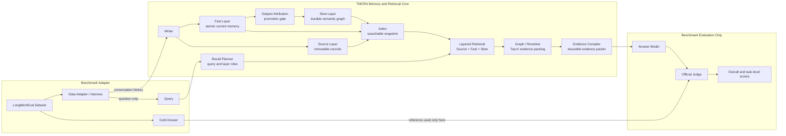

# TMCRA Agent Memory System — LongMemEval Benchmark

[简体中文](README.zh-CN.md)

TMCRA is a scope-isolated, layered memory engine for agents. It keeps durable evidence outside the answer model and returns a compact, traceable memory context for each query. This directory contains the LongMemEval pipeline used to build memory, retrieve across multiple memory layers, compile evidence, generate answers, and evaluate the predictions.

## Benchmark result

TMCRA achieves **82.2%** on LongMemEval.

| Task category | Correct / Total | Accuracy |
| --- | ---: | ---: |
| Knowledge Update | 71 / 78 | 91.0% |
| Multi-session | 90 / 133 | 67.7% |
| Single-session Assistant | 55 / 56 | 98.2% |
| Single-session Preference | 27 / 30 | 90.0% |
| Single-session User | 67 / 70 | 95.7% |
| Temporal Reasoning | 101 / 133 | 75.9% |
| **Overall** | **411 / 500** | **82.2%** |

The machine-readable aggregate result is available in [`results/benchmark.json`](results/benchmark.json).

## Architecture

TMCRA separates immutable source evidence from two derived memory layers. The Writer stores conversation messages in Source and extracts normalized, current assertions into Fast. Subject Attribution prevents quoted or third-party facts from being promoted under the wrong identity. Eligible records are reorganized into the durable Slow semantic graph, while every derived memory remains traceable to Source.

At query time, the Recall Planner resolves the question and assigns layer roles. Source, Fast, and Slow candidates are retrieved, graph-ranked, reranked, and packed into a bounded evidence set. The Evidence Compiler converts this set into a structured, provenance-bound packet. TMCRA's online memory boundary ends at prompt-ready evidence; answer generation and the official Judge belong to the benchmark harness.



### Component responsibilities

- **Source** retains the immutable conversation record and is the final evidence authority.
- **Fast** stores source-bound atomic facts, relations, updates, and current state.
- **Subject Attribution** stops quoted or third-party information from being assigned to the wrong subject.
- **Slow** organizes eligible cross-session information into a durable semantic graph; it supplements rather than replaces Source.
- **Recall Planner** interprets the question and memory-layer roles without reading the gold answer.
- **Layered Retrieval** searches Source, Fast, and Slow, then performs graph ranking, reranking, deduplication, temporal handling, and fixed Top-K packing.
- **Evidence Compiler** produces a structured evidence packet whose claims remain bound to source IDs.
- **Answer Model and Judge** are benchmark-only components and are not part of the TMCRA online recall service.

Gold answers are isolated from Writer, Planner, Retrieval, Evidence Compiler, and Answer Model. They are only read by the final Judge.

## Viewing and reproducing the benchmark

- **View the published result:** [`results/benchmark.json`](results/benchmark.json) contains the public overall and task-level summary shown above.
- **Rerun the pipeline:** the commands below execute memory construction, layered retrieval, evidence compilation, answer generation, and evaluation. The published 82.2% scorecard is a frozen v5 result; this release uses the security-hardened v6 answer protocol, and fresh external model calls can produce a different score.

### Tested environment

- Linux
- Python 3.12.3
- NVIDIA GPU with 24 GiB VRAM or more
- CUDA 12.8
- PyTorch 2.11.0 + cu128
- Transformers 5.10.2

The full S500 run also needs sufficient system memory and disk space for Writer journals, graphs, indexes, checkpoints, and intermediate evidence artifacts.

### 1. Clone and install

```bash
git lfs install
GIT_LFS_SKIP_SMUDGE=1 git clone https://github.com/reshuibuduo/TMCRA-Agent-Memory.git
cd TMCRA-Agent-Memory/benchmarks/longmemeval
git lfs pull --include="models/tmcra_v4_longmemeval_s500_20260715/*.pt"

python3.12 -m venv .venv
source .venv/bin/activate
python -m pip install --upgrade pip
python -m pip install -r requirements.txt
python -m pip install -e .
```

`GIT_LFS_SKIP_SMUDGE=1` prevents the clone from downloading unrelated historical LFS objects; the next command pulls only the three checkpoints required by this benchmark.

### 2. Verify checkpoints and download external assets

The three TMCRA checkpoints are tracked in the repository with Git LFS under `models/tmcra_v4_longmemeval_s500_20260715/`. The asset script verifies their byte sizes and SHA-256 hashes in place; it does not create a second copy. It then downloads the official cleaned LongMemEval-S dataset and the revision-pinned BGE models:

```bash
python scripts/fetch_assets.py --manifest configs/assets.lock.json --kind all
```

The dataset comes from the [official LongMemEval release](https://github.com/xiaowu0162/LongMemEval) and [cleaned dataset repository](https://huggingface.co/datasets/xiaowu0162/longmemeval-cleaned). BGE-M3 and the reranker are downloaded from the official [BAAI/bge-m3](https://huggingface.co/BAAI/bge-m3) and [BAAI/bge-reranker-v2-m3](https://huggingface.co/BAAI/bge-reranker-v2-m3) model pages.

File assets are verified against `configs/assets.lock.json`. If the checkout contains only LFS pointer files, the script stops with the exact `git lfs pull` command required to fetch the weights.

### 3. Configure model providers

```bash
cp configs/writer.env.example configs/writer.env
cp configs/answer.env.example configs/answer.env
cp configs/judge.env.example configs/judge.env
cp configs/run.env.example configs/run.env
```

Edit the four generated files:

- `writer.env` configures one OpenAI-compatible DeepSeek endpoint and a comma-separated key pool used by the Writer, subject-attribution pass, and evidence planner. The endpoint must accept `deepseek-v4-flash` and `deepseek-v4-pro`, or map those names to compatible deployments.
- `answer.env` must expose the exact model identifier `gpt-5.4` through an OpenAI-compatible endpoint.
- `judge.env` must expose `gpt-4o-2024-08-06`. The public command passes the `gpt-4o` alias, and the bundled evaluator resolves that alias to the fixed version.
- `run.env` selects local paths, concurrency, and PyTorch devices.

Keep API keys local; the repository `.gitignore` excludes the real configuration files.

The default Judge wire format is OpenAI Chat Completions. Set `OPENAI_WIRE_API=responses` in `judge.env` only if the configured endpoint implements the Responses API.

### 4. Run the offline smoke test

This test uses a synthetic fixture and does not call external model providers:

```bash
bash scripts/reproduce_smoke.sh
```

### 5. Run LongMemEval-S500

```bash
bash scripts/reproduce_s500.sh
```

The script executes and validates the following stages:

```text
prepare data and ordered QIDs
  -> build Writer journals, Source/Fast/Slow memory, and indexes
  -> retrieve Source + Fast + Slow evidence
  -> compile operation-bound evidence packets
  -> generate answers with GPT-5.4
  -> evaluate with the official GPT-4o Judge
  -> export overall and task-level scores
```

Important outputs are written under `runs/longmemeval_s500/`:

```text
BUILD_COMPLETE
retrieval_s500/evidence_windows.jsonl
retrieval_s500/retrieval_debug.jsonl
retrieval_s500_compiled/COMPILE_COMPLETE
retrieval_s500_compiled/evidence_windows.jsonl
answers_s500/answers.jsonl
official_judge_gpt4o_20240806.jsonl
scorecard.json
```

Before the next stage starts, the runner requires completion markers or reports, exact row counts, and the same ordered QID set. Judge rows are also checked for boolean labels from `gpt-4o-2024-08-06`. Compatible incomplete retrieval, compilation, answer, and judge artifacts are resumed. Build recovery is fail-closed and may require the explicit review flags printed by the build runner; an incompatible answer protocol requires a new answer output directory.

## Repository layout

```text
configs/      provider examples and hash-pinned asset manifest
fixtures/     synthetic offline test data
results/      published aggregate score
scripts/      asset download, validation, smoke, and S500 runners
src/          TMCRA V4 benchmark core, LongMemEval harness, and minimal adapter
tests/        offline schema, gold-isolation, and score aggregation tests
../../models/tmcra_v4_longmemeval_s500_20260715/
              Git LFS checkpoints used by this benchmark
```

Production HTTP APIs, account systems, billing, tenant authorization, deployment files, credentials, runtime databases, raw provider logs, and control-plane components are intentionally excluded.

## Validation

```bash
python -m compileall -q src scripts tests
python -m pytest
```

Before publishing a release, also run a secret scan, dependency vulnerability scan, SBOM generation, and a manual review of staged files and release assets.

## Citation

When reporting these results, identify the repository version and cite the [LongMemEval project](https://github.com/xiaowu0162/LongMemEval) and its paper.

## License

TMCRA benchmark code is released under the [Apache License 2.0](../../LICENSE). LongMemEval and the downloaded BGE models retain their own licenses; see [`THIRD_PARTY_NOTICES.md`](THIRD_PARTY_NOTICES.md).
