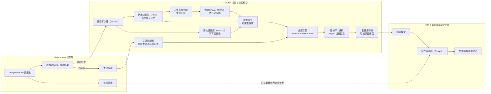

# TMCRA 智能体记忆系统 — LongMemEval Benchmark

[English](README.md)

TMCRA 是面向智能体的作用域隔离、分层记忆引擎。它将可追溯的长期证据保存在回答模型之外，并在每次查询时返回紧凑、可核验的记忆上下文。本目录包含 TMCRA 的 LongMemEval benchmark 链路，覆盖记忆构建、多层召回、证据整理、回答生成与结果评测。

## Benchmark 成绩

TMCRA 在 LongMemEval benchmark 上取得 **82.2%**。

| 任务类型 | 正确数 / 样本数 | 准确率 |
| --- | ---: | ---: |
| 信息更新（Knowledge Update） | 71 / 78 | 91.0% |
| 跨会话信息整合（Multi-session） | 90 / 133 | 67.7% |
| 单会话助手信息（Single-session Assistant） | 55 / 56 | 98.2% |
| 单会话偏好理解（Single-session Preference） | 27 / 30 | 90.0% |
| 单会话用户信息（Single-session User） | 67 / 70 | 95.7% |
| 时间推理（Temporal Reasoning） | 101 / 133 | 75.9% |
| **总成绩** | **411 / 500** | **82.2%** |

机器可读的汇总成绩位于 [`results/benchmark.json`](results/benchmark.json)。

## 架构

TMCRA 将不可变证据与两类派生记忆分离。Writer 把对话消息保存到 Source，同时将可复用、反映当前状态的事实提取并规范化到 Fast。Subject Attribution 用于阻止引用内容或第三方事实被错误归属；通过门控的记录会进一步组织为稳定的 Slow 语义图，而所有派生记忆始终能够追溯到 Source。

查询时，Recall Planner 先解析问题并为各记忆层分配职责。系统随后从 Source、Fast、Slow 生成候选，经过图排序、重排、去重、时间处理和有界 Top-K 打包，再由 Evidence Compiler 生成带来源绑定的结构化证据包。TMCRA 线上记忆服务的边界止于可注入提示词的证据；回答生成和 Official Judge 属于 benchmark harness。



### 核心组件职责

- **Source** 保存不可变的对话原文，是最终证据来源。
- **Fast** 保存与 Source 绑定的原子事实、关系、更新和当前状态。
- **Subject Attribution** 防止引用内容或第三方信息被归属到错误主体。
- **Slow** 把符合条件的跨会话信息组织为稳定的语义图；它补充 Source，但不能替代 Source。
- **Recall Planner** 解析问题和各层职责，但不读取 gold answer。
- **Layered Retrieval** 同时搜索 Source、Fast、Slow，并执行图排序、重排、去重、时间处理与固定 Top-K 打包。
- **Evidence Compiler** 输出带 Source ID 绑定的结构化证据包。
- **Answer Model 与 Judge** 只属于 benchmark，不属于 TMCRA 线上召回服务。

Gold answer 与 Writer、Planner、Retrieval、Evidence Compiler、Answer Model 完全隔离，只允许最终 Judge 读取。

## 查看与复现 benchmark

- **查看公开成绩：** [`results/benchmark.json`](results/benchmark.json) 包含上表所示的总成绩与六类分项汇总。
- **重跑完整链路：** 下面的命令会重新执行记忆构建、分层召回、证据整理、回答生成和评测。公开的 82.2% 是冻结的 v5 成绩；本次发布使用经过安全加固的 v6 回答协议，重新调用外部模型时成绩可能发生波动。

### 已验证环境

- Linux
- Python 3.12.3
- 24 GiB 或更高显存的 NVIDIA GPU
- CUDA 12.8
- PyTorch 2.11.0 + cu128
- Transformers 5.10.2

完整 S500 运行还需要足够的内存与磁盘空间，用于 Writer 日志、图、索引、checkpoint 和中间证据产物。

### 1. 克隆并安装

```bash
git lfs install
GIT_LFS_SKIP_SMUDGE=1 git clone https://github.com/reshuibuduo/TMCRA-Agent-Memory.git
cd TMCRA-Agent-Memory/benchmarks/longmemeval
git lfs pull --include="models/tmcra_v4_longmemeval_s500_20260715/*.pt"

python3.12 -m venv .venv
source .venv/bin/activate
python -m pip install --upgrade pip
python -m pip install -r requirements.txt
python -m pip install -e .
```

`GIT_LFS_SKIP_SMUDGE=1` 会阻止 clone 阶段下载无关的历史 LFS 对象；后续命令只拉取本 benchmark 所需的三个 checkpoint。

### 2. 校验 checkpoint 并下载外部资产

三个 TMCRA checkpoint 已通过 Git LFS 保存在仓库的 `models/tmcra_v4_longmemeval_s500_20260715/` 目录。资产脚本会直接校验这些文件的字节数与 SHA-256，不会重复复制；随后下载官方清洗版 LongMemEval-S 和固定 revision 的 BGE 模型：

```bash
python scripts/fetch_assets.py --manifest configs/assets.lock.json --kind all
```

数据来自 [LongMemEval 官方仓库](https://github.com/xiaowu0162/LongMemEval)和[清洗版数据集](https://huggingface.co/datasets/xiaowu0162/longmemeval-cleaned)。BGE-M3 与 reranker 来自官方 [BAAI/bge-m3](https://huggingface.co/BAAI/bge-m3) 和 [BAAI/bge-reranker-v2-m3](https://huggingface.co/BAAI/bge-reranker-v2-m3) 页面。

文件类资产在启用前都会按照 `configs/assets.lock.json` 校验。如果当前检出只有 LFS 指针文件，脚本会停止并给出获取权重所需的完整 `git lfs pull` 命令。

### 3. 配置模型服务

```bash
cp configs/writer.env.example configs/writer.env
cp configs/answer.env.example configs/answer.env
cp configs/judge.env.example configs/judge.env
cp configs/run.env.example configs/run.env
```

编辑生成的四个文件：

- `writer.env` 配置一个兼容 OpenAI API 格式的 DeepSeek 服务和逗号分隔的 key 池，供 Writer、主体归属判断和证据规划器共同使用。该服务需要接受 `deepseek-v4-flash` 与 `deepseek-v4-pro`，或者在网关中把这两个名称映射到兼容部署。
- `answer.env` 的兼容 OpenAI API 服务必须以 `gpt-5.4` 这一精确名称提供回答模型。
- `judge.env` 的服务必须提供 `gpt-4o-2024-08-06`。公开命令传入 `gpt-4o` 别名，内置评测器会将其固定解析为该版本。
- `run.env` 配置本地路径、并发数与 PyTorch 设备。

API key 只保留在本地，仓库的 `.gitignore` 已排除真实配置文件。

Judge 默认使用 OpenAI Chat Completions 请求格式。只有当服务端实现了 Responses API 时，才在 `judge.env` 中设置 `OPENAI_WIRE_API=responses`。

### 4. 运行离线 smoke test

该测试只使用合成 fixture，不会调用外部模型服务：

```bash
bash scripts/reproduce_smoke.sh
```

### 5. 运行 LongMemEval-S500

```bash
bash scripts/reproduce_s500.sh
```

脚本会顺序执行并校验：

```text
准备数据与有序 QID
  -> 构建 Writer 日志、Source/Fast/Slow 记忆和索引
  -> 召回 Source + Fast + Slow 证据
  -> 整理 operation-bound evidence packet
  -> 使用 GPT-5.4 生成回答
  -> 使用官方 GPT-4o Judge 评测
  -> 导出总成绩与分项成绩
```

关键产物位于 `runs/longmemeval_s500/`：

```text
BUILD_COMPLETE
retrieval_s500/evidence_windows.jsonl
retrieval_s500/retrieval_debug.jsonl
retrieval_s500_compiled/COMPILE_COMPLETE
retrieval_s500_compiled/evidence_windows.jsonl
answers_s500/answers.jsonl
official_judge_gpt4o_20240806.jsonl
scorecard.json
```

进入下一阶段前，脚本会检查完成标记或报告、准确的产物行数，以及与输入一致的有序 QID。Judge 产物还必须包含由 `gpt-4o-2024-08-06` 生成的布尔标签。兼容的召回、证据整理、回答和 Judge 产物会从断点继续；构建恢复采用故障关闭策略，必要时会要求使用构建脚本打印出的显式审查参数。回答协议不兼容时必须使用新的回答输出目录。

## 仓库结构

```text
configs/      配置示例与 hash 固定的资产清单
fixtures/     合成离线测试数据
results/      公开的汇总成绩
scripts/      资产下载、校验、smoke 与 S500 运行脚本
src/          TMCRA V4 benchmark 核心、LongMemEval harness 与最小 adapter
tests/        离线 schema、gold 隔离和成绩汇总测试
../../models/tmcra_v4_longmemeval_s500_20260715/
              本 benchmark 使用的 Git LFS checkpoint
```

线上 HTTP API、账户系统、计费、租户授权、部署文件、凭据、运行数据库、供应商原始日志和控制面均不在本仓库范围内。

## 校验

```bash
python -m compileall -q src scripts tests
python -m pytest
```

正式发布前还需要执行 secret scan、依赖漏洞扫描、SBOM，并人工审查暂存文件和 Release 资产。

## 引用

报告本结果时，请注明所使用的仓库版本，并引用 [LongMemEval 项目](https://github.com/xiaowu0162/LongMemEval)及其论文。

## 许可证

TMCRA benchmark 代码采用 [Apache License 2.0](../../LICENSE)。LongMemEval 与下载的 BGE 模型保留各自许可证，详见 [`THIRD_PARTY_NOTICES.md`](THIRD_PARTY_NOTICES.md)。
